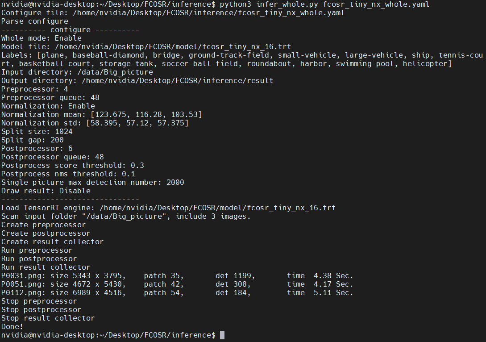

# FCOSR TensorRT Inference

> **[FCOSR: A Simple Anchor-free Rotated Detector for Aerial Object Detection](#)**<br>
> arXiv preprint ([arXiv:2111.10780](https://arxiv.org/abs/2111.10780)).


This implement is modified from [TensorRT/efficientdet](https://github.com/NVIDIA/TensorRT/tree/main/samples/python/efficientdet). 

The inference framework is shown bellow.


Detection result


Log


## Recommend system environments:
 - Jetson Xavier NX / Jetson AGX Xavier
 - python 3.6
 - JetPack 4.6
 - CUDA 10.2 (from JetPack)
 - cuDNN 8.2.1 (from JetPack)
 - OpenCV 4.1.1 (from JetPack)
 - TensorRT 8.0.1.6 (from JetPack)

## Install

```shell
pip install Cython
pip install -r requirements.txt
```

**Note:** DOTA_devkit. [INSTALL.md](https://github.com/lzh420202/FCOSR/blob/master/install.md#install-fcosr)


## How to use

We define configure file (yaml) to replace plenty of args.
```shell
# Small pictures inference mode
python infer_multi.py fcosr_tiny_nx.yaml
# Big whole picture inference mode
python infer_whole.py fcosr_tiny_agx_whole.yaml
```

A configure file demo is:
```yaml
whole_mode: 1  # whole mode switch
model:
  engine_file: '/home/nvidia/Desktop/FCOSR/model/epoch_36_16_lite_nx.trt' # TensorRT engine file path
  labels: 'labels.txt' # calss name
  num_speed: 2000 # FPS compute
io:
  input_dir: '/home/nvidia/DOTA_TEST/images/' # image folder path
  output_dir: 'result' # output
preprocess: # preprocess configure
  num_process: 8 # multi process
  queue_length: 40
  normalization: # normalization parameters
    enable: 1 # switch
    mean:
      - 123.675
      - 116.28
      - 103.53
    std:
      - 58.395
      - 57.12
      - 57.375
  split:    # split configure, only support whole mode.
    subsize: 1024
    gap: 200
postprocess: # postprocess configure
  num_process: 6 # multi process
  queue_length: 40
  nms_threshold: 0.1 # poly nms threshold 
  score_threshold: 0.1 # poly nms score threshold
  max_det_num: 2000
  draw_image: # visualization configure
    enable: 0 # switch
    output_dir: 'result' # output
    num: 20 # number
```
